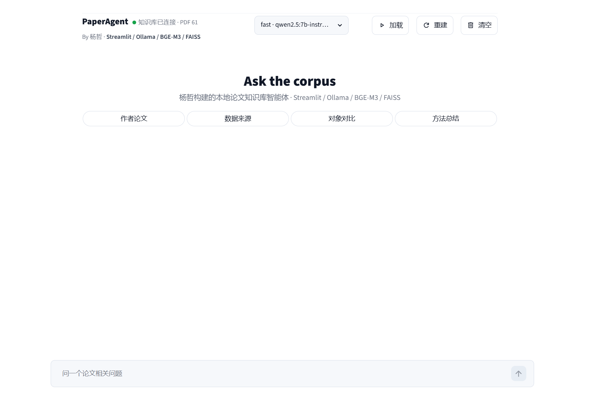
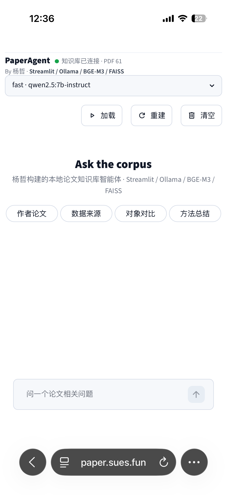
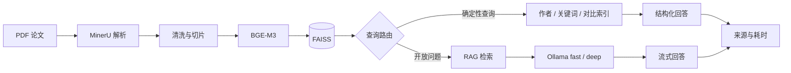

# PaperAgent

**简体中文** | [English](README_EN.md)

面向学术论文的本地知识库 RAG Agent，支持确定性检索、论文对比、来源追踪和本地大模型问答。

[在线体验](https://paper.sues.fun) · Streamlit · FAISS · BGE-M3 · MinerU · Ollama

## 界面





## 项目简介

PaperAgent 将论文解析、向量检索和本地大模型整合为一套可追踪的学术问答流程。系统不会把所有问题直接交给大模型：作者、关键词和指定论文对比等查询优先通过确定性索引处理，开放问题再进入 RAG，从而降低无效生成并缩短响应时间。

当前在线版本接入 61 篇团队论文，支持 fast/deep 模型切换、流式回答、文件级来源追踪和运行耗时诊断。

## 核心能力

- **混合查询路由**：确定性索引优先，开放问题进入 RAG
- **论文知识库**：MinerU 解析、文本清洗切片、BGE-M3 向量化、FAISS 检索
- **结构化检索**：作者论文清单、数据源关键词、指定论文及研究对象对比
- **可信回答**：回答关联文件级来源和检索片段
- **本地部署**：Ollama 承载 fast/deep 模型，不依赖外部模型 API

## 架构



## 快速开始

要求：Python 3.10+、Ollama，以及本地 BGE-M3 兼容嵌入模型。

```bash
pip install -r requirements.txt
cp .env.example .env
streamlit run app.py --server.port 8000
```

完整检索需要自行准备论文语料，并通过 `scripts/parse_with_mineru.sh` 和 `scripts/rebuild_index.sh` 构建本地向量库。默认 Ollama 地址为 `http://127.0.0.1:11434`。

## 测试

```bash
python -m unittest discover -s tests
```

测试覆盖查询路由、Ollama 客户端、性能配置、RAG 提示词和离线脚本，无需私有论文库或正在运行的 Ollama 服务。

## 数据说明

公开仓库不包含私有或受版权保护的论文、MinerU 解析结果、FAISS 索引及模型权重。相关目录仅保留占位文件，完整在线版本运行于私有服务器。

## License

[Apache License 2.0](LICENSE)
