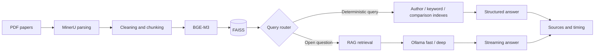

# PaperAgent

[简体中文](README.md) | **English**

A local RAG agent for academic paper knowledge bases, with deterministic retrieval, paper comparison, source tracing, and local LLM question answering.

[Live Demo](https://paper.sues.fun) · Streamlit · FAISS · BGE-M3 · MinerU · Ollama

## Interface


## Overview

PaperAgent combines paper parsing, vector retrieval, and local language models into a traceable academic question-answering workflow. It does not send every query directly to an LLM: author, keyword, and explicit paper-comparison queries use deterministic indexes first, while open-ended questions fall back to RAG. This reduces unnecessary generation and improves response time.

The live deployment currently indexes 61 team papers and supports fast/deep model profiles, streaming answers, file-level source tracing, and runtime diagnostics.

## Highlights

- **Hybrid query routing**: deterministic indexes first, RAG for open-ended questions
- **Paper knowledge base**: MinerU parsing, text cleaning and chunking, BGE-M3 embeddings, and FAISS retrieval
- **Structured retrieval**: author lists, data-source keywords, paper comparison, and object-level comparison
- **Traceable answers**: file-level sources and retrieved excerpts attached to responses
- **Local deployment**: fast/deep models served by Ollama without external model APIs

## Architecture



## Quick Start

Requirements: Python 3.10+, Ollama, and a local BGE-M3-compatible embedding model.

```bash
pip install -r requirements.txt
cp .env.example .env
streamlit run app.py --server.port 8000
```

Full retrieval requires your own paper corpus. Build the local vector store with `scripts/parse_with_mineru.sh` and `scripts/rebuild_index.sh`. Ollama defaults to `http://127.0.0.1:11434`.

## Tests

```bash
python -m unittest discover -s tests
```

The test suite covers query routing, the Ollama client, performance configuration, RAG prompts, and offline scripts. It does not require the private corpus or a running Ollama instance.

## Data Policy

The public repository excludes private or copyrighted papers, MinerU output, FAISS indexes, and model weights. Their directories contain placeholders only; the full demo runs on a private server.

## License

[Apache License 2.0](LICENSE)
